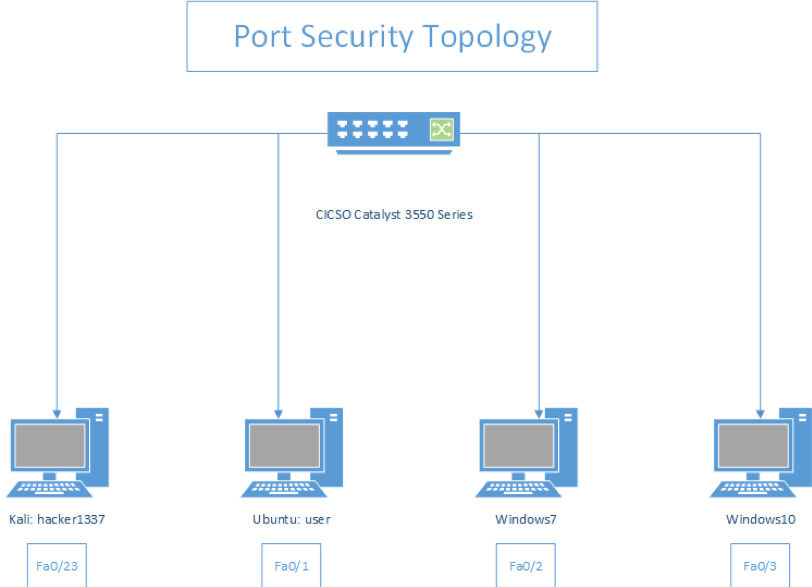
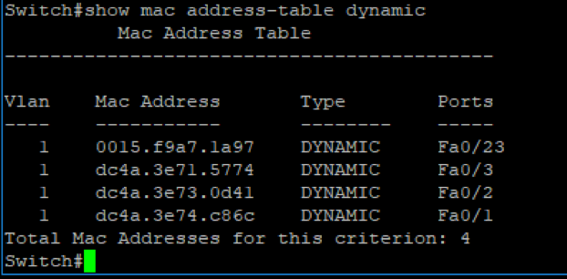
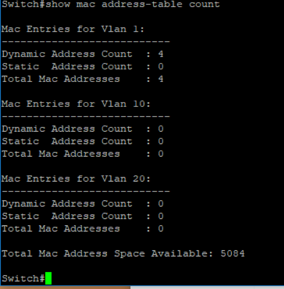
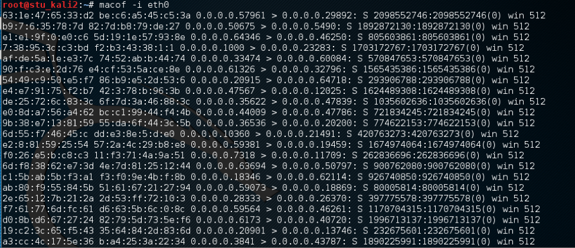
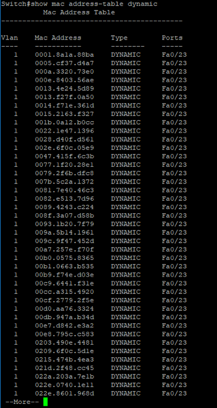
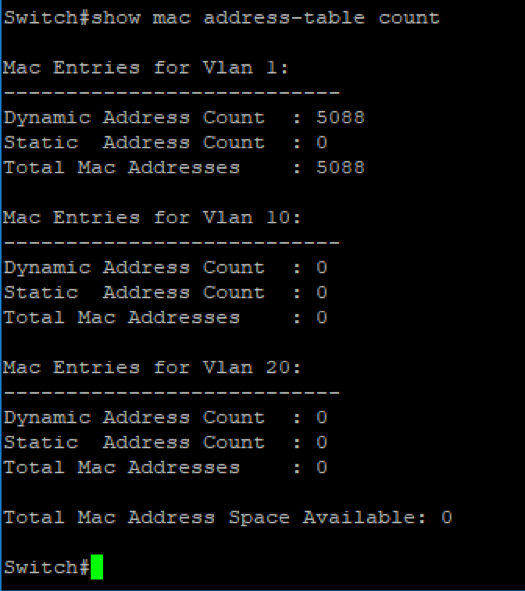
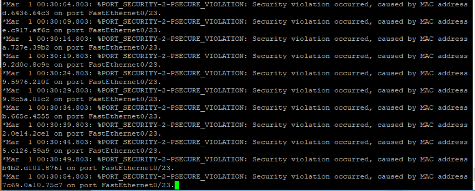
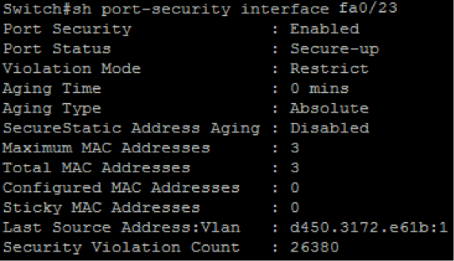
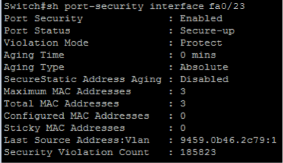
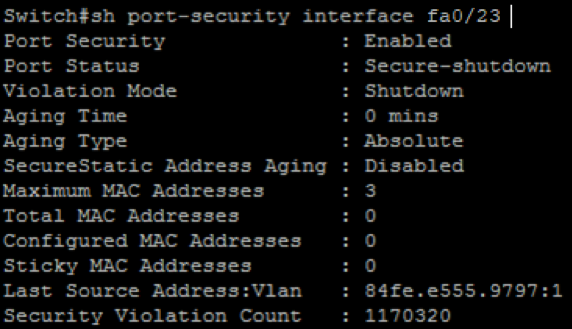

# **Port Security Attack & Mitigation**
##   **Introduction**
Before talking about port security we need to mention the operation process of layer 2 devices as known as “switches.” Switches operate by building tables, called context-addressable memory (CAM) tables, which the switch uses t map MAC address to their corresponding port. Depending on the version and capability of the switch, these tables can only maps a limited number of entries involving both (mac address, switch port number). One attack called CAM overflow takes advantage of this limitation to overflow the CAM table and disable the switching logic of the switch.

This attack occurs when an attacker connects to a port (or multiple ports) on a switch and then crafts requests from thousands of fake random mac addresses. This makes the switch think that these are real mac address connections, with their corresponding ports, and use these to fill up the CAM table. This CAM table overflow attack turns the switch into a hub, meaning it enables the attacker to see the traffic going in/out of the switch. This could lead to a man-in-the-middle-attack. The idea of securing the port and limiting number of devices/entries helps to eliminate the attack as we will discover in the following section.

##    **Constructed Topology**

##  **Attack Steps**
After booting up our Kali box and inspecting the CAM Table on oour switch, we can see that the switch’s CAM table is configured to learn dynamically:

Also if we look up the count for the CAM table we will see only 4 devices as expected

After that, I opened up our Kali machine and used the “macof” tool, which basically sends out requests from a number of random fake mac address that will be registered in the switch’s CAM table. I ran the command ‘macof –i eth0` the flag -i eth0' to specify the interface that the tool will send traffic through.

Now, if we take a look at the MAC address table, we will see the CAM table has been overflowed from the ‘macof’ tool we started.

Moreover, if we take a look at the count we will see that no more space available.

##    **Mitigation the Attack**
One of the most popular mitigations against CAM overflows on Cisco routers is port-security. Port-security has three modes which we will talk about the following sections.

###           **Restrict Mode**
Restrict mode has the ability to make the port stay open when an attack occurs, However, it will drop any packets that violate the mac address rules set on the switch.
For example, as the screenshot below depicts, we have only allowed 3 mac address to be learned dynamically. When a fourth mac address wants to be registered on that port. The switch will raise a violation flag and drop the packet.

An example of the switch output when I ran the attack again is shown in screenshot above.
Now if we want to take a look at that interface to see how many mac addresses have violated our rule. We can see that there have been 26380 violations on that port.

###        **Protect Mode**
Protect mode also allows a port to stay up during an attack similar to what we saw in restrict mode. In protect mode it drops any packets violating the rule, however, unlike restrict mode it drops the packets but it does not report back the violation to the switch monitoring the session as we saw in the restrict mode.

When we ran the macof tool again against the switch, and then looked at the port, we saw that there were 185823 violations on that port but no warnings of the violations were generated.
###          **Shutdown Mode**
Lastly, shutdown mode works as follows, when a violation occurs a notification “SNMP” message will be sent and the port will immediately shutdown.

For example, we configured our switch to accept a maximum of three mac address, and when this rule is violated, it will shut down the port.

As the screenshot below shows, we after running the tool again on the same port we can see the port is shut down because we violated the rule of a maximum of three MAC address.

# References

[Port Security Packet Life](http://packetlife.net/blog/2010/may/3/port-security/)

[Port Security Cisco Guied](https://www.cisco.com/c/en/us/td/docs/switches/lan/catalyst4500/12-2/25ew/configuration/guide/conf/port_sec.html/)

